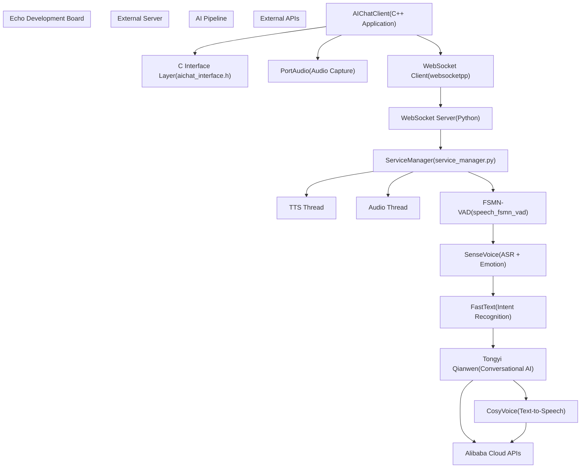
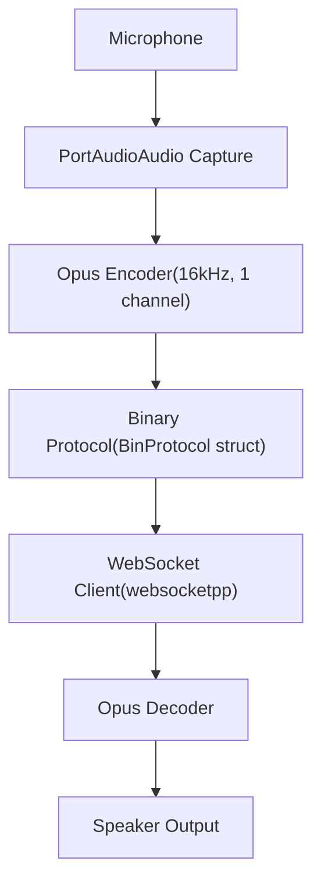
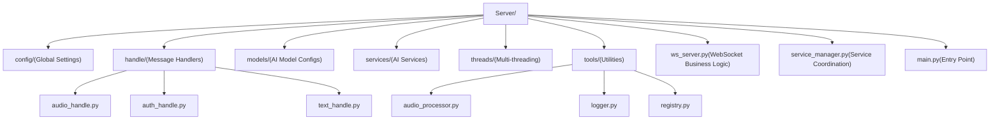
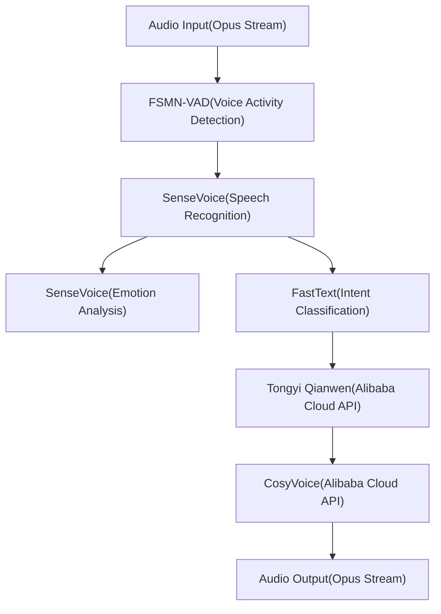
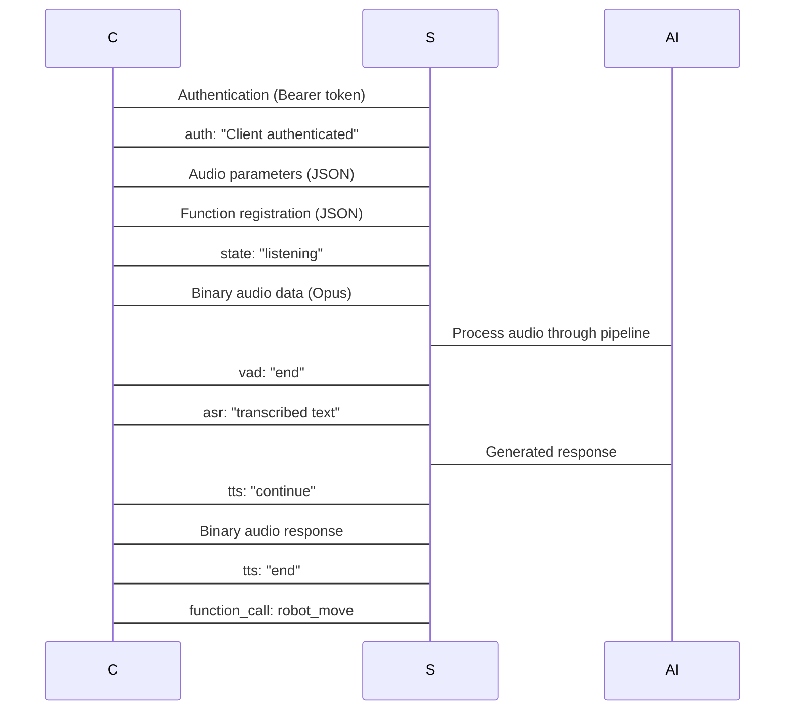

# AIChat Demo - Voice Assistant

> **Relevant source files**
> * [AIChat_demo/Client/README.md](https://github.com/No-Chicken/Demo4Echo/blob/80ef46db/AIChat_demo/Client/README.md?plain=1)
> * [AIChat_demo/README.md](https://github.com/No-Chicken/Demo4Echo/blob/80ef46db/AIChat_demo/README.md?plain=1)
> * [AIChat_demo/Server/README.md](https://github.com/No-Chicken/Demo4Echo/blob/80ef46db/AIChat_demo/Server/README.md?plain=1)
> * [AIChat_demo/assets/AIchat_states.png](https://github.com/No-Chicken/Demo4Echo/blob/80ef46db/AIChat_demo/assets/AIchat_states.png)
> * [DeskBot_demo/README.md](https://github.com/No-Chicken/Demo4Echo/blob/80ef46db/DeskBot_demo/README.md?plain=1)
> * [README.md](https://github.com/No-Chicken/Demo4Echo/blob/80ef46db/README.md?plain=1)
> * [assets/AIChatDiagram.png](https://github.com/No-Chicken/Demo4Echo/blob/80ef46db/assets/AIChatDiagram.png)
> * [assets/AIchat_states.png](https://github.com/No-Chicken/Demo4Echo/blob/80ef46db/assets/AIchat_states.png)

This document covers the standalone AI voice assistant demo system, which provides real-time voice interaction capabilities for the Echo development board. The system uses a client-server architecture where the client runs on the Echo board and communicates with an AI processing server. For information about how this system integrates into the main DeskBot application, see [ChatBot Integration](/No-Chicken/Demo4Echo/4.3-chatbot-integration).

## System Overview

The AIChat demo implements a complete voice assistant pipeline that can operate independently or be integrated into larger applications. The system is designed to run on lightweight Linux development boards while leveraging cloud-based AI services for complex processing tasks.



**Sources:** [README.md L55-L102](https://github.com/No-Chicken/Demo4Echo/blob/80ef46db/README.md?plain=1#L55-L102)

 [AIChat_demo/Client/README.md L1-L176](https://github.com/No-Chicken/Demo4Echo/blob/80ef46db/AIChat_demo/Client/README.md?plain=1#L1-L176)

 [AIChat_demo/Server/README.md L1-L109](https://github.com/No-Chicken/Demo4Echo/blob/80ef46db/AIChat_demo/Server/README.md?plain=1#L1-L109)

## Client Architecture

The client application is implemented in C++ and handles audio capture, WebSocket communication, and provides a C interface for integration with other systems.

### Core Components

The main client executable `AIChatClient` orchestrates several key components:

| Component | Technology | Purpose |
| --- | --- | --- |
| Audio Capture | PortAudio | Real-time audio input from microphone |
| WebSocket Client | websocketpp + boost | Communication with server |
| Audio Encoding | Opus | Efficient audio compression |
| Protocol Handler | Custom binary protocol | Audio data transmission |
| C Interface | C wrapper functions | Integration with LVGL applications |

### Audio Processing Pipeline



The audio data is packaged using a custom binary protocol defined in the client:

```
struct BinProtocol {    uint16_t version;       // Protocol version    uint16_t type;          // 0 for audio data    uint32_t payload_size;  // Audio data length    uint8_t payload[];      // Opus audio data} __attribute__((packed));
```

**Sources:** [AIChat_demo/Client/README.md L128-L137](https://github.com/No-Chicken/Demo4Echo/blob/80ef46db/AIChat_demo/Client/README.md?plain=1#L128-L137)

### WebSocket Communication

The client implements several message types for coordinating with the server:

* **Authentication**: Bearer token, device MAC address, protocol version
* **Audio Parameters**: Format specification (Opus, 16kHz, mono, 40ms frames)
* **State Changes**: Idle, listening, processing states
* **Function Registration**: Robot control capabilities
* **Function Calls**: Intent-based robot movement commands

**Sources:** [AIChat_demo/Client/README.md L92-L176](https://github.com/No-Chicken/Demo4Echo/blob/80ef46db/AIChat_demo/Client/README.md?plain=1#L92-L176)

### Build and Deployment

The client supports both x86 development and ARM cross-compilation:

```
# X86 development buildmkdir build && cd buildcmake ..make # ARM cross-compilation for Echo boardcmake -DTARGET_ARM=ON ..makemake install
```

**Sources:** [AIChat_demo/Client/README.md L49-L90](https://github.com/No-Chicken/Demo4Echo/blob/80ef46db/AIChat_demo/Client/README.md?plain=1#L49-L90)

## Server Architecture

The Python server implements the AI processing pipeline and manages WebSocket connections with multiple clients.

### Directory Structure



**Sources:** [AIChat_demo/Server/README.md L27-L47](https://github.com/No-Chicken/Demo4Echo/blob/80ef46db/AIChat_demo/Server/README.md?plain=1#L27-L47)

### AI Model Pipeline

The server coordinates multiple AI models in a sequential pipeline:



### Server Response Types

The server sends various message types back to clients:

| Message Type | Purpose | Example States |
| --- | --- | --- |
| `auth` | Authentication status | `"Client authenticated"`, `"Authentication failed"` |
| `vad` | Voice activity detection | `"no_speech"`, `"end"`, `"too_long"` |
| `asr` | Speech recognition results | Transcribed text content |
| `tts` | Text-to-speech status | `"end"`, `"continue"` |
| `chat` | Conversation status | `"end"`, `"continue"` |

**Sources:** [AIChat_demo/Server/README.md L49-L109](https://github.com/No-Chicken/Demo4Echo/blob/80ef46db/AIChat_demo/Server/README.md?plain=1#L49-L109)

### Environment Setup

The server requires a Python 3.10 virtual environment with specific dependencies:

```
conda create --prefix ./AIChatServerEnv python=3.10conda activate ./AIChatServerEnvpip install -r requirements.txtpython main.py --access_token="123456" --aliyun_api_key="sk-your-api-key"
```

**Sources:** [AIChat_demo/Server/README.md L3-L25](https://github.com/No-Chicken/Demo4Echo/blob/80ef46db/AIChat_demo/Server/README.md?plain=1#L3-L25)

## Communication Protocol

The system uses WebSocket for real-time bidirectional communication with a mixed JSON/binary protocol.

### Message Flow



### Protocol Specifications

**Authentication Headers:**

* `Authorization: "Bearer " + access_token`
* `Device-Id: MAC address`
* `Protocol-Version: defined protocol version`

**Binary Audio Protocol:**

* Version: 2 bytes (protocol version)
* Type: 2 bytes (0 for audio data)
* Payload Size: 4 bytes (audio data length)
* Payload: Variable length Opus audio data

**Sources:** [AIChat_demo/Client/README.md L92-L176](https://github.com/No-Chicken/Demo4Echo/blob/80ef46db/AIChat_demo/Client/README.md?plain=1#L92-L176)

 [AIChat_demo/Server/README.md L105-L109](https://github.com/No-Chicken/Demo4Echo/blob/80ef46db/AIChat_demo/Server/README.md?plain=1#L105-L109)

## Integration Patterns

The AIChat demo supports multiple integration patterns:

### Standalone Operation

Run independently for voice assistant functionality:

```
# Serverpython main.py --access_token="123456" # Client  ./AIChatClient 172.32.0.100 8000 123456
```

### DeskBot Integration

Integrated into the main DeskBot demo through the C interface layer, allowing LVGL pages to access voice assistant functionality and control robot movement based on voice commands.

**Sources:** [README.md

49](https://github.com/No-Chicken/Demo4Echo/blob/80ef46db/README.md?plain=1#L49-L49)

 [DeskBot_demo/README.md L42-L48](https://github.com/No-Chicken/Demo4Echo/blob/80ef46db/DeskBot_demo/README.md?plain=1#L42-L48)

 [AIChat_demo/README.md L1-L3](https://github.com/No-Chicken/Demo4Echo/blob/80ef46db/AIChat_demo/README.md?plain=1#L1-L3)