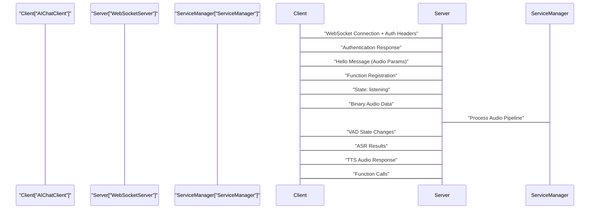

# Communication Protocol

> **Relevant source files**
> * [AIChat_demo/Client/README.md](https://github.com/No-Chicken/Demo4Echo/blob/80ef46db/AIChat_demo/Client/README.md?plain=1)
> * [AIChat_demo/Server/README.md](https://github.com/No-Chicken/Demo4Echo/blob/80ef46db/AIChat_demo/Server/README.md?plain=1)
> * [AIChat_demo/Server/main.py](https://github.com/No-Chicken/Demo4Echo/blob/80ef46db/AIChat_demo/Server/main.py)
> * [AIChat_demo/assets/AIchat_states.png](https://github.com/No-Chicken/Demo4Echo/blob/80ef46db/AIChat_demo/assets/AIchat_states.png)
> * [assets/AIChatDiagram.png](https://github.com/No-Chicken/Demo4Echo/blob/80ef46db/assets/AIChatDiagram.png)
> * [assets/AIchat_states.png](https://github.com/No-Chicken/Demo4Echo/blob/80ef46db/assets/AIchat_states.png)

This document describes the WebSocket-based communication protocol used between the AIChat client and server components. It covers message formats, authentication, audio streaming, and function call mechanisms that enable real-time voice interaction with AI services.

For information about the client architecture implementation, see [Client Architecture](/No-Chicken/Demo4Echo/5.1-client-architecture). For details about the server-side AI model pipeline, see [Server Architecture](/No-Chicken/Demo4Echo/5.2-server-architecture).

## Protocol Overview

The AIChat system uses WebSocket connections for bidirectional communication between the C++ client application and Python server. The protocol supports both JSON text messages for control and metadata, and binary messages for streaming audio data.

**Connection Flow:**



Sources: [AIChat_demo/Client/README.md L92-L176](https://github.com/No-Chicken/Demo4Echo/blob/80ef46db/AIChat_demo/Client/README.md?plain=1#L92-L176)

 [AIChat_demo/Server/README.md L49-L109](https://github.com/No-Chicken/Demo4Echo/blob/80ef46db/AIChat_demo/Server/README.md?plain=1#L49-L109)

## Authentication and Connection Establishment

The client establishes a WebSocket connection with authentication headers that must be validated by the server before any message exchange can occur.

### Authentication Headers

The client sends these headers during WebSocket handshake:

| Header | Description | Example |
| --- | --- | --- |
| `Authorization` | Bearer token with access token | `"Bearer 123456"` |
| `Device-Id` | Client device MAC address | Device MAC address |
| `Protocol-Version` | Communication protocol version | Defined protocol version |

### Hello Message

After successful authentication, the client sends audio configuration:

```
{    "type": "hello",    "audio_params": {        "format": "opus",        "sample_rate": "16000",         "channels": "1",        "frame_duration": "40"    }}
```

### Authentication Response

The server responds with authentication status:

```
{   "type": "auth",   "message": "Client authenticated"}
```

Possible `message` values: `"Client authenticated"`, `"Authentication failed"`

Sources: [AIChat_demo/Client/README.md L96-L116](https://github.com/No-Chicken/Demo4Echo/blob/80ef46db/AIChat_demo/Client/README.md?plain=1#L96-L116)

 [AIChat_demo/Server/README.md L54-L61](https://github.com/No-Chicken/Demo4Echo/blob/80ef46db/AIChat_demo/Server/README.md?plain=1#L54-L61)

## Message Types and Formats

The protocol defines distinct message types for different aspects of the voice interaction pipeline.

### Client State Messages

The client reports its operational state to coordinate audio processing:

```
{    "type": "state",    "state": "idle"}
```

Supported states include `"idle"`, `"listening"`, and others as defined in the client implementation.

### Server Pipeline Messages

The server sends messages for each stage of the AI processing pipeline:

**Voice Activity Detection (VAD):**

```
{   "type": "vad",   "state": "no_speech"}
```

States: `"no_speech"`, `"end"`, `"too_long"`

**Automatic Speech Recognition (ASR):**

```
{   "type": "asr",    "text": "speech的内容"}
```

**Text-to-Speech (TTS) Status:**

```
{   "type": "tts",   "state": "end"}
```

States: `"continue"`, `"end"`

**Chat Dialogue Status:**

```
{   "type": "chat",   "dialogue": "end"}
```

States: `"continue"`, `"end"`

Sources: [AIChat_demo/Client/README.md L118-L127](https://github.com/No-Chicken/Demo4Echo/blob/80ef46db/AIChat_demo/Client/README.md?plain=1#L118-L127)

 [AIChat_demo/Server/README.md L63-L101](https://github.com/No-Chicken/Demo4Echo/blob/80ef46db/AIChat_demo/Server/README.md?plain=1#L63-L101)

## Binary Audio Protocol

Audio data transmission uses a custom binary protocol structure for efficient streaming of Opus-encoded audio.

### Binary Protocol Structure

```

```

### C++ Structure Definition

The client uses this packed structure for audio transmission:

```
struct BinProtocol {    uint16_t version;       // Protocol version    uint16_t type;          // 0 for audio data      uint32_t payload_size;  // Audio data length    uint8_t payload[];      // Opus audio data} __attribute__((packed));
```

### Python Server Protocol

The server uses equivalent binary unpacking:

```
version: int     # Protocol version (2 bytes)type: int        # Message type (2 bytes) payload: bytes   # Opus format message payload
```

Sources: [AIChat_demo/Client/README.md L128-L137](https://github.com/No-Chicken/Demo4Echo/blob/80ef46db/AIChat_demo/Client/README.md?plain=1#L128-L137)

 [AIChat_demo/Server/README.md L103-L109](https://github.com/No-Chicken/Demo4Echo/blob/80ef46db/AIChat_demo/Server/README.md?plain=1#L103-L109)

## Function Registration and Calling

The protocol supports dynamic function registration to enable the AI to control client-side hardware and features.

### Function Registration Message

The client registers available functions with the server:

```
{    "type": "reg_func",    "functions": [        {            "name": "robot_move",            "description": "让机器人运动",            "arguments": {                "direction": "字符数据,分别有forward,backward,left和right"            }        }    ]}
```

### Function Call Response

The server can invoke registered functions by sending:

```
{    "function_call": {        "name": "robot_move",         "arguments": {            "direction": "forward",            "speed": "1"        }    }}
```

**Function Call Flow:**

```

```

Sources: [AIChat_demo/Client/README.md L139-L176](https://github.com/No-Chicken/Demo4Echo/blob/80ef46db/AIChat_demo/Client/README.md?plain=1#L139-L176)

## WebSocket Server Implementation

The server implementation coordinates multiple components to handle the communication protocol.

### Server Architecture

```

```

### Main Server Initialization

The server startup process initializes all protocol handling components:

```
# Initialize VAD, ASR, chat, intent, TTS servicesservice_manager = ServiceManager() # Start TTS generation thread  tts_generate_thread = TTSGenerateThread(service_manager) # Start audio data sending threadtts_send_thread = AudioSendThread(service_manager) tts_send_thread.start() # Start WebSocket serverserver = WebSocketServer(host="0.0.0.0", port=8000,                         access_token="123456",                         service_manager=service_manager)
```

Sources: [AIChat_demo/Server/main.py L10-L34](https://github.com/No-Chicken/Demo4Echo/blob/80ef46db/AIChat_demo/Server/main.py#L10-L34)

## Error Handling and Connection Management

The protocol includes mechanisms for handling connection failures and service errors.

### Authentication Failure

When authentication fails, the server sends:

```
{   "type": "auth",   "message": "Authentication failed"}
```

### Connection Lifecycle

The WebSocket connection is managed with proper cleanup and resource management to handle interruptions gracefully.

Sources: [AIChat_demo/Server/README.md L54-L61](https://github.com/No-Chicken/Demo4Echo/blob/80ef46db/AIChat_demo/Server/README.md?plain=1#L54-L61)

 [AIChat_demo/Server/main.py L25-L49](https://github.com/No-Chicken/Demo4Echo/blob/80ef46db/AIChat_demo/Server/main.py#L25-L49)