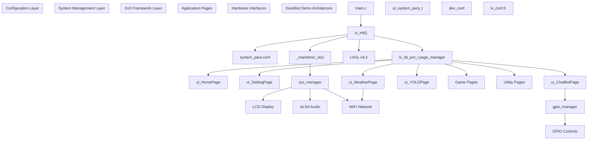
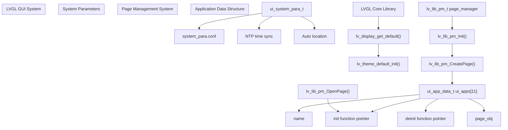
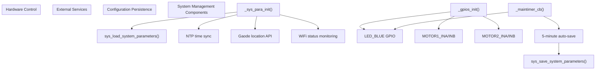
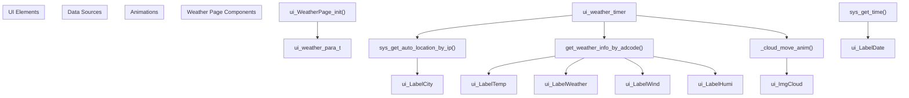
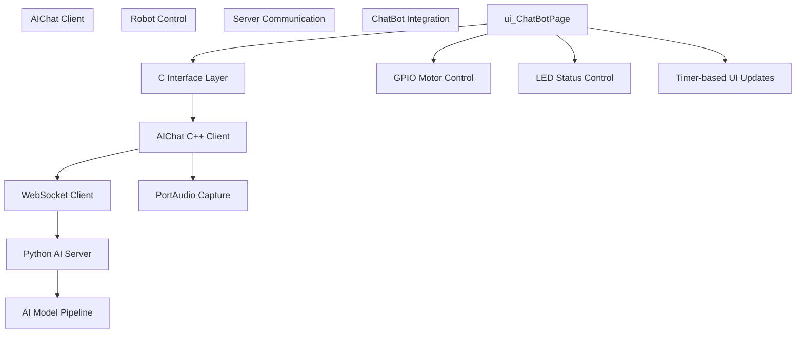

# DeskBot Demo - AI Desktop Assistant

> **Relevant source files**
> * [AIChat_demo/README.md](https://github.com/No-Chicken/Demo4Echo/blob/80ef46db/AIChat_demo/README.md?plain=1)
> * [DeskBot_demo/README.md](https://github.com/No-Chicken/Demo4Echo/blob/80ef46db/DeskBot_demo/README.md?plain=1)
> * [DeskBot_demo/gui_app/pages/ui_WeatherPage/ui_WeatherPage.c](https://github.com/No-Chicken/Demo4Echo/blob/80ef46db/DeskBot_demo/gui_app/pages/ui_WeatherPage/ui_WeatherPage.c)
> * [DeskBot_demo/gui_app/ui.c](https://github.com/No-Chicken/Demo4Echo/blob/80ef46db/DeskBot_demo/gui_app/ui.c)
> * [DeskBot_demo/gui_app/ui.h](https://github.com/No-Chicken/Demo4Echo/blob/80ef46db/DeskBot_demo/gui_app/ui.h)
> * [README.md](https://github.com/No-Chicken/Demo4Echo/blob/80ef46db/README.md?plain=1)

The DeskBot Demo is the main integrated application of the Echo development board that combines an LVGL-based GUI framework with multiple standalone demos to create a comprehensive AI desktop assistant robot. This system serves as the primary user interface and orchestrates various capabilities including voice interaction, object detection, weather information, games, and utilities.

This document covers the DeskBot Demo's architecture, GUI system, and application integration. For detailed information about the standalone AI voice assistant, see [AIChat Demo - Voice Assistant](/No-Chicken/Demo4Echo/5-aichat-demo-voice-assistant). For object detection capabilities, see [YOLOv5 Demo - Object Detection](/No-Chicken/Demo4Echo/6-yolov5-demo-object-detection).

## Overall Architecture

The DeskBot Demo follows a layered architecture with clear separation between hardware abstraction, system management, GUI framework, and application logic.

Sources: [DeskBot_demo/main.c](https://github.com/No-Chicken/Demo4Echo/blob/80ef46db/DeskBot_demo/main.c)

 [DeskBot_demo/gui_app/ui.c L1-L289](https://github.com/No-Chicken/Demo4Echo/blob/80ef46db/DeskBot_demo/gui_app/ui.c#L1-L289)

 [DeskBot_demo/gui_app/ui.h L1-L61](https://github.com/No-Chicken/Demo4Echo/blob/80ef46db/DeskBot_demo/gui_app/ui.h#L1-L61)

 [README.md L29-L47](https://github.com/No-Chicken/Demo4Echo/blob/80ef46db/README.md?plain=1#L29-L47)

## GUI System and Page Management

The DeskBot Demo uses LVGL v9.2 as its GUI framework with a custom page management system that enables modular application development.

The page management system is implemented using a centralized array of application data structures:

| Application | Init Function | Page Type |
| --- | --- | --- |
| HomePage | `ui_HomePage_init` | App launcher |
| SettingPage | `ui_SettingPage_init` | System configuration |
| WeatherPage | `ui_WeatherPage_init` | Weather information |
| ChatBotPage | `ui_ChatBotPage_init` | AI voice assistant |
| YOLOPage | `ui_YOLOPage_init` | Object detection |
| Game2048Page | `ui_Game2048Page_init` | 2048 game |
| GameMuyuPage | `ui_GameMuyuPage_init` | Muyu game |
| GameMemoryPage | `ui_GameMemoryPage_init` | Memory game |
| DrawPage | `ui_DrawPage_init` | Drawing application |
| CalculatorPage | `ui_CalculatorPage_init` | Calculator |
| CalendarPage | `ui_CalendarPage_init` | Calendar |

Sources: [DeskBot_demo/gui_app/ui.c L29-L111](https://github.com/No-Chicken/Demo4Echo/blob/80ef46db/DeskBot_demo/gui_app/ui.c#L29-L111)

 [DeskBot_demo/gui_app/ui.h L16-L61](https://github.com/No-Chicken/Demo4Echo/blob/80ef46db/DeskBot_demo/gui_app/ui.h#L16-L61)

 [DeskBot_demo/gui_app/ui.c L272-L289](https://github.com/No-Chicken/Demo4Echo/blob/80ef46db/DeskBot_demo/gui_app/ui.c#L272-L289)

## System Management Layer

The system management layer provides hardware abstraction and manages external service integration through a centralized parameter system.

The system parameters structure includes:

| Parameter Category | Fields | Purpose |
| --- | --- | --- |
| Time Management | `year`, `month`, `day`, `hour`, `minute`, `auto_time` | System time and NTP sync |
| Location Services | `location.city`, `location.adcode`, `auto_location`, `gaode_api_key` | Weather and location data |
| Device Settings | `brightness`, `sound`, `wifi_connected` | Hardware configuration |
| AIChat Integration | `aichat_app_info.*` | Voice assistant connection |

Sources: [DeskBot_demo/gui_app/ui.c L139-L211](https://github.com/No-Chicken/Demo4Echo/blob/80ef46db/DeskBot_demo/gui_app/ui.c#L139-L211)

 [DeskBot_demo/gui_app/ui.c L213-L227](https://github.com/No-Chicken/Demo4Echo/blob/80ef46db/DeskBot_demo/gui_app/ui.c#L213-L227)

 [DeskBot_demo/gui_app/ui.c L232-L268](https://github.com/No-Chicken/Demo4Echo/blob/80ef46db/DeskBot_demo/gui_app/ui.c#L232-L268)

## Application Pages Integration

The DeskBot Demo integrates various standalone demos through its page system, with each page representing a distinct application module.

### Weather Page Integration

The weather page demonstrates external API integration with automatic data refresh:

### ChatBot Page Integration

The ChatBot page serves as the integration point between the DeskBot GUI and the standalone AIChat demo:

Sources: [DeskBot_demo/gui_app/pages/ui_WeatherPage/ui_WeatherPage.c L1-L297](https://github.com/No-Chicken/Demo4Echo/blob/80ef46db/DeskBot_demo/gui_app/pages/ui_WeatherPage/ui_WeatherPage.c#L1-L297)

 [DeskBot_demo/gui_app/pages/ui_ChatBotPage/](https://github.com/No-Chicken/Demo4Echo/blob/80ef46db/DeskBot_demo/gui_app/pages/ui_ChatBotPage/)

 [README.md

49](https://github.com/No-Chicken/Demo4Echo/blob/80ef46db/README.md?plain=1#L49-L49)

## Configuration and Build System

The DeskBot Demo supports both SDL simulation and ARM cross-compilation through a flexible configuration system:

### Build Configuration Matrix

| Configuration | Purpose | Key Settings |
| --- | --- | --- |
| SDL Simulation | Desktop development | `LV_USE_SIMULATOR=1` in `dev_conf` |
| ARM Target | Echo board deployment | `LV_USE_SIMULATOR=0`, `TARGET_ARM=ON` |
| LVGL Settings | GUI framework config | `lv_conf.h` with `LV_COLOR_DEPTH=16` |

### System Configuration Files

| File | Purpose | Key Parameters |
| --- | --- | --- |
| `system_para.conf` | Runtime configuration | API keys, network settings, device parameters |
| `dev_conf` | Build-time switches | Simulation mode, debug settings |
| `lv_conf.h` | LVGL configuration | Color depth, memory settings, feature flags |

The main timer system provides periodic maintenance functions including LED status indication, parameter persistence, and time synchronization every 5 minutes.

Sources: [DeskBot_demo/README.md L4-L41](https://github.com/No-Chicken/Demo4Echo/blob/80ef46db/DeskBot_demo/README.md?plain=1#L4-L41)

 [DeskBot_demo/gui_app/ui.c L21-L23](https://github.com/No-Chicken/Demo4Echo/blob/80ef46db/DeskBot_demo/gui_app/ui.c#L21-L23)

 [DeskBot_demo/gui_app/ui.c L232-L268](https://github.com/No-Chicken/Demo4Echo/blob/80ef46db/DeskBot_demo/gui_app/ui.c#L232-L268)