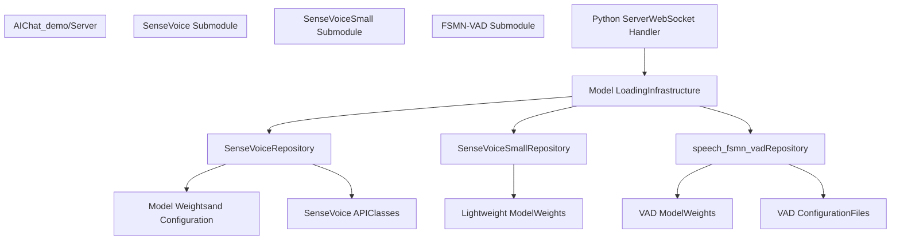
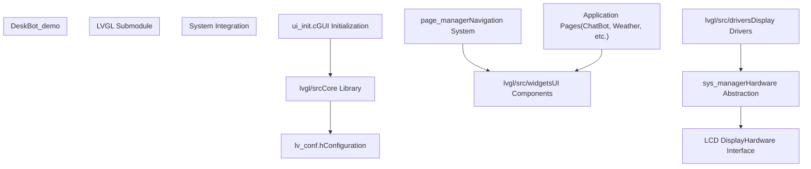
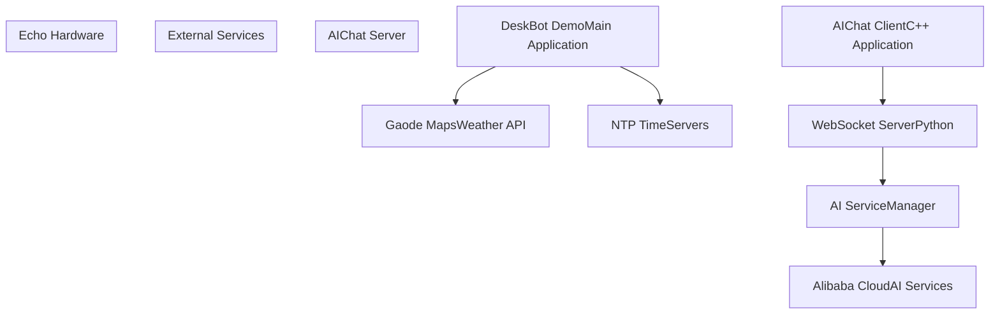

# External Dependencies and Submodules

> **Relevant source files**
> * [.gitmodules](https://github.com/No-Chicken/Demo4Echo/blob/80ef46db/.gitmodules)

## Purpose and Scope

This document provides a comprehensive reference for all external dependencies, Git submodules, and third-party integrations used across the Demo4Echo repository. It covers the AI models, GUI frameworks, hardware abstraction libraries, and external services that enable the Echo development board's various demo applications.

For information about how these dependencies are configured and built, see [Getting Started](/No-Chicken/Demo4Echo/2-getting-started). For details about how specific dependencies integrate into the DeskBot demo, see [DeskBot Demo - AI Desktop Assistant](/No-Chicken/Demo4Echo/4-deskbot-demo-ai-desktop-assistant). For AIChat-specific dependency usage, see [AIChat Demo - Voice Assistant](/No-Chicken/Demo4Echo/5-aichat-demo-voice-assistant).

## Dependency Strategy Overview

The Demo4Echo project employs a hybrid dependency management approach that combines Git submodules for source-level integration with external service APIs for cloud-based functionality. This strategy supports both offline local development and cloud-enhanced production deployments.

### Dependency Architecture

```mermaid
flowchart TD

subgraph Build_Dependencies ["Build Dependencies"]
end

subgraph External_APIs ["External APIs"]
end

subgraph Git_Submodules ["Git Submodules"]
end

subgraph Demo4Echo_Repository ["Demo4Echo Repository"]
end

MainRepo["Demo4EchoMain Repository"]
SenseVoiceGH["SenseVoicegithub.com/FunAudioLLM"]
SenseVoiceMS["SenseVoiceSmallmodelscope.cn/iic"]
FSMNVAD["speech_fsmn_vadmodelscope.cn/iic"]
LVGLSub["lvglgithub.com/lvglrelease/v9.2"]
RKMPISub["rkmpi_demosgithub.com/LuckfoxTECH"]
AliCloud["Alibaba CloudTTS/ASR/Chat APIs"]
GaodeMaps["Gaode MapsWeather API"]
NTPService["NTP TimeSynchronization"]
CMakeBuild["CMake Build System"]
CrossToolchain["ARM Cross Compiler"]
ALSA["ALSA Audio Libraries"]
PortAudio["PortAudio Library"]

    MainRepo --> SenseVoiceGH
    MainRepo --> SenseVoiceMS
    MainRepo --> FSMNVAD
    MainRepo --> LVGLSub
    MainRepo --> RKMPISub
    MainRepo --> AliCloud
    MainRepo --> GaodeMaps
    MainRepo --> NTPService
    MainRepo --> CMakeBuild
    MainRepo --> CrossToolchain
    MainRepo --> ALSA
    MainRepo --> PortAudio
```



**Sources:** [.gitmodules

1-17](https://github.com/No-Chicken/Demo4Echo/blob/80ef46db/.gitmodules#L1-L17)

## Git Submodules

The repository includes five Git submodules that provide core functionality for AI processing, GUI rendering, and hardware abstraction.

### AI Model Submodules

The project integrates three AI model repositories to support voice activity detection, speech recognition, and emotion detection:

| Submodule Path | Repository Source | Purpose | Branch/Version |
| --- | --- | --- | --- |
| `AIChat_demo/Server/models/FunAudioLLM/SenseVoice` | github.com/FunAudioLLM/SenseVoice.git | Speech recognition and emotion detection | default |
| `AIChat_demo/Server/models/FunAudioLLM/iic/SenseVoiceSmall` | modelscope.cn/iic/SenseVoiceSmall.git | Lightweight speech recognition model | default |
| `AIChat_demo/Server/models/FunAudioLLM/iic/speech_fsmn_vad_zh-cn-16k-common-pytorch` | modelscope.cn/iic/speech_fsmn_vad_zh-cn-16k-common-pytorch.git | Voice activity detection for Chinese language | default |

#### SenseVoice Integration



**Sources:** [.gitmodules

1-9](https://github.com/No-Chicken/Demo4Echo/blob/80ef46db/.gitmodules#L1-L9)

### GUI Framework Submodule

The LVGL (Light and Versatile Graphics Library) submodule provides the core GUI framework for the DeskBot demo:

| Submodule Path | Repository Source | Purpose | Branch/Version |
| --- | --- | --- | --- |
| `DeskBot_demo/lvgl` | github.com/lvgl/lvgl.git | GUI framework and widget library | release/v9.2 |

#### LVGL Integration Architecture



**Sources:** [.gitmodules

10-13](https://github.com/No-Chicken/Demo4Echo/blob/80ef46db/.gitmodules#L10-L13)

### Hardware Abstraction Submodule

The rkmpi_demos submodule provides Rockchip media processing examples and libraries:

| Submodule Path | Repository Source | Purpose | Branch/Version |
| --- | --- | --- | --- |
| `rkmpi_demos` | github.com/LuckfoxTECH/luckfox_pico_rkmpi_example.git | Rockchip media processing interface examples | default |

**Sources:** [.gitmodules

14-16](https://github.com/No-Chicken/Demo4Echo/blob/80ef46db/.gitmodules#L14-L16)

## External Service Dependencies

The project integrates with several external cloud services and APIs for enhanced functionality:

### Alibaba Cloud Services

The AIChat demo leverages multiple Alibaba Cloud APIs for AI-powered voice interaction:

| Service | API Endpoint | Purpose | Integration Point |
| --- | --- | --- | --- |
| Tongyi Qianwen | dashscope.aliyuncs.com | Conversational AI chat responses | AIChat Server |
| CosyVoice | dashscope.aliyuncs.com | Text-to-speech synthesis | AIChat Server |
| ASR Service | nls-gateway.cn-shanghai.aliyuncs.com | Speech recognition (backup) | AIChat Server |

### Location and Weather Services

| Service | API Endpoint | Purpose | Integration Point |
| --- | --- | --- | --- |
| Gaode Maps API | restapi.amap.com | Weather data and location services | DeskBot Weather Page |
| NTP Time Service | Various NTP servers | System time synchronization | DeskBot System Manager |

### Service Integration Flow



**Sources:** Based on service integration patterns observed across demo applications

## Build System Dependencies

The project relies on several build-time dependencies and development tools:

### Core Build Tools

| Dependency | Purpose | Integration |
| --- | --- | --- |
| CMake (≥3.10) | Build system generator | Root CMakeLists.txt files |
| ARM GCC Cross Compiler | Cross-compilation for Echo board | Toolchain configuration |
| pkg-config | Library dependency resolution | CMake find_package calls |

### Native Libraries

| Library | Purpose | Link Requirements |
| --- | --- | --- |
| ALSA (libasound) | Audio system interface | `-lasound` |
| PortAudio | Cross-platform audio I/O | `-lportaudio` |
| PThread | Multi-threading support | `-lpthread` |
| Math Library | Mathematical operations | `-lm` |

### Development Tools

| Tool | Purpose | Usage Context |
| --- | --- | --- |
| SDL2 | GUI simulation on desktop | LVGL simulator builds |
| GDB | Debugging support | Cross-debugging setup |
| Git LFS | Large file storage | AI model weights |

## Submodule Management Commands

### Initialization and Updates

```
# Initialize all submodules after cloninggit submodule update --init --recursive # Update all submodules to latest commitsgit submodule update --remote # Update specific submodulegit submodule update --remote AIChat_demo/Server/models/FunAudioLLM/SenseVoice
```

### Submodule Status and Verification

```
# Check submodule statusgit submodule status # Verify submodule integritygit submodule foreach git status
```

**Sources:** [.gitmodules

1-17](https://github.com/No-Chicken/Demo4Echo/blob/80ef46db/.gitmodules#L1-L17)

## Version Compatibility Matrix

| Component | Version/Branch | Compatibility Notes |
| --- | --- | --- |
| LVGL | release/v9.2 | Pinned to stable release for GUI consistency |
| SenseVoice | main/latest | Rolling updates for model improvements |
| rkmpi_demos | main/latest | Hardware-specific, updated with driver changes |
| CMake | ≥3.10 | Minimum version for cross-compilation features |
| GCC ARM | ≥7.0 | Required for C++17 features in AIChat client |

This dependency matrix ensures reproducible builds while allowing selective updates for performance and feature improvements.

**Sources:** [.gitmodules

10-13](https://github.com/No-Chicken/Demo4Echo/blob/80ef46db/.gitmodules#L10-L13)

 for version specifications