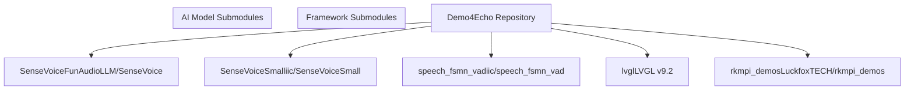
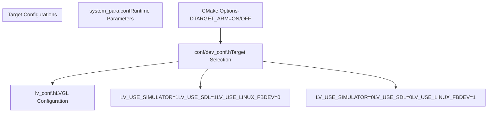
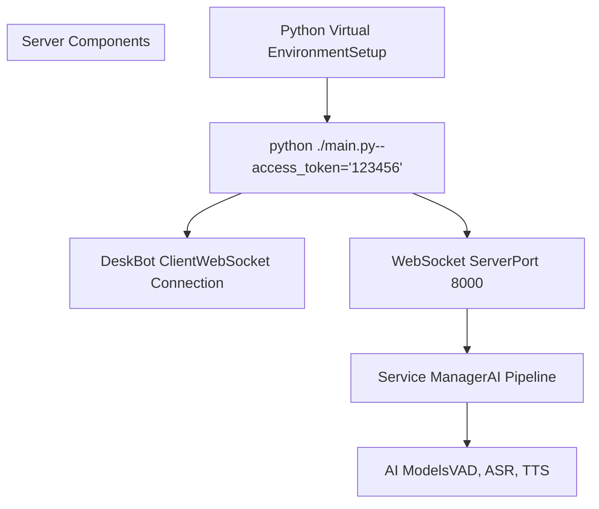
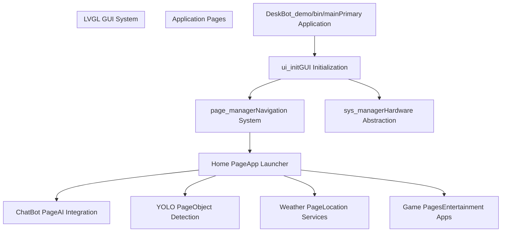

# Getting Started

> **Relevant source files**
> * [AIChat_demo/Client/CMakeLists.txt](https://github.com/No-Chicken/Demo4Echo/blob/80ef46db/AIChat_demo/Client/CMakeLists.txt)
> * [AIChat_demo/README.md](https://github.com/No-Chicken/Demo4Echo/blob/80ef46db/AIChat_demo/README.md?plain=1)
> * [DeskBot_demo/README.md](https://github.com/No-Chicken/Demo4Echo/blob/80ef46db/DeskBot_demo/README.md?plain=1)
> * [DeskBot_demo/conf/dev_conf.h](https://github.com/No-Chicken/Demo4Echo/blob/80ef46db/DeskBot_demo/conf/dev_conf.h)
> * [DeskBot_demo/lv_conf.h](https://github.com/No-Chicken/Demo4Echo/blob/80ef46db/DeskBot_demo/lv_conf.h)
> * [DeskBot_demo/utils/system_para.conf](https://github.com/No-Chicken/Demo4Echo/blob/80ef46db/DeskBot_demo/utils/system_para.conf)
> * [README.md](https://github.com/No-Chicken/Demo4Echo/blob/80ef46db/README.md?plain=1)

This page provides essential setup and build instructions for the Echo development board demo repository. It covers initial configuration, building for different targets, and running the main demo applications. For detailed information about individual demo components, see [DeskBot Demo - AI Desktop Assistant](/No-Chicken/Demo4Echo/4-deskbot-demo-ai-desktop-assistant), [AIChat Demo - Voice Assistant](/No-Chicken/Demo4Echo/5-aichat-demo-voice-assistant), and [YOLOv5 Demo - Object Detection](/No-Chicken/Demo4Echo/6-yolov5-demo-object-detection). For comprehensive configuration options, see [Configuration Reference](/No-Chicken/Demo4Echo/7-configuration-reference).

## Prerequisites and Dependencies

The Echo demos require several external dependencies and submodules. The project uses CMake as the build system and supports both x86 simulation and ARM cross-compilation.

### Required System Packages

| Package | Purpose | Required For |
| --- | --- | --- |
| `cmake` (≥3.10) | Build system | All demos |
| `SDL2` development libraries | Simulation on desktop | Simulator builds |
| `portaudio-2.0` | Audio processing | AIChat demo |
| `opus` | Audio compression | AIChat demo |
| `jsoncpp` | JSON parsing | AIChat demo |
| ARM cross-compiler | Target compilation | Hardware builds |

### Git Submodules

The repository includes several Git submodules that must be initialized:



Sources: [README.md L1-L112](https://github.com/No-Chicken/Demo4Echo/blob/80ef46db/README.md?plain=1#L1-L112)

## Build Configuration System

The project uses a layered configuration system that controls both LVGL settings and target-specific build options.

### Configuration Architecture



**Key Configuration Files:**

* `LV_USE_SIMULATOR` flag in [DeskBot_demo/conf/dev_conf.h

8](https://github.com/No-Chicken/Demo4Echo/blob/80ef46db/DeskBot_demo/conf/dev_conf.h#L8-L8)

 controls target mode
* [DeskBot_demo/lv_conf.h

25](https://github.com/No-Chicken/Demo4Echo/blob/80ef46db/DeskBot_demo/lv_conf.h#L25-L25)

 includes `dev_conf.h` for conditional compilation
* [DeskBot_demo/utils/system_para.conf L1-L23](https://github.com/No-Chicken/Demo4Echo/blob/80ef46db/DeskBot_demo/utils/system_para.conf#L1-L23)

 contains runtime system parameters

Sources: [DeskBot_demo/conf/dev_conf.h L1-L24](https://github.com/No-Chicken/Demo4Echo/blob/80ef46db/DeskBot_demo/conf/dev_conf.h#L1-L24)

 [DeskBot_demo/lv_conf.h L24-L26](https://github.com/No-Chicken/Demo4Echo/blob/80ef46db/DeskBot_demo/lv_conf.h#L24-L26)

 [DeskBot_demo/utils/system_para.conf L1-L23](https://github.com/No-Chicken/Demo4Echo/blob/80ef46db/DeskBot_demo/utils/system_para.conf#L1-L23)

## Building for Desktop Simulation

The simulator build allows testing the LVGL GUI on a desktop computer using SDL2.

### Simulator Build Process

1. **Configure for Simulation**

Edit [DeskBot_demo/conf/dev_conf.h

8](https://github.com/No-Chicken/Demo4Echo/blob/80ef46db/DeskBot_demo/conf/dev_conf.h#L8-L8)

 to set:

```
#define LV_USE_SIMULATOR 1
```
2. **Build Commands**

```
cd ./DeskBot_demomkdir ./buildcd ./buildcmake ..make
```
3. **Run Simulator**

```
cd ../bin./main
```

The simulator automatically configures LVGL to use `LV_USE_SDL=1` and disables hardware-specific drivers through the conditional compilation in [DeskBot_demo/conf/dev_conf.h L10-L18](https://github.com/No-Chicken/Demo4Echo/blob/80ef46db/DeskBot_demo/conf/dev_conf.h#L10-L18)

Sources: [DeskBot_demo/README.md L4-L21](https://github.com/No-Chicken/Demo4Echo/blob/80ef46db/DeskBot_demo/README.md?plain=1#L4-L21)

 [DeskBot_demo/conf/dev_conf.h L8-L18](https://github.com/No-Chicken/Demo4Echo/blob/80ef46db/DeskBot_demo/conf/dev_conf.h#L8-L18)

## Building for Echo Hardware

Hardware builds target the Echo development board's ARM architecture and require cross-compilation.

### Hardware Build Process

1. **Configure for Hardware**

Edit [DeskBot_demo/conf/dev_conf.h

8](https://github.com/No-Chicken/Demo4Echo/blob/80ef46db/DeskBot_demo/conf/dev_conf.h#L8-L8)

 to set:

```
#define LV_USE_SIMULATOR 0
```
2. **Cross-Compile**

```
cd ./buildcmake .. -DTARGET_ARM=ONmake
```
3. **Deploy to Hardware**

```
# Copy entire bin directory to Echo boardscp -r ../bin/ user@echo-board:/path/to/deployment/
```

The `TARGET_ARM=ON` flag activates the cross-compilation toolchain defined in [AIChat_demo/Client/CMakeLists.txt L8-L16](https://github.com/No-Chicken/Demo4Echo/blob/80ef46db/AIChat_demo/Client/CMakeLists.txt#L8-L16)

Sources: [DeskBot_demo/README.md L23-L40](https://github.com/No-Chicken/Demo4Echo/blob/80ef46db/DeskBot_demo/README.md?plain=1#L23-L40)

 [AIChat_demo/Client/CMakeLists.txt L4-L16](https://github.com/No-Chicken/Demo4Echo/blob/80ef46db/AIChat_demo/Client/CMakeLists.txt#L4-L16)

## System Configuration

Before running any demos, several configuration files must be updated with your specific API keys and network settings.

### Essential Configuration Parameters

The main configuration file [DeskBot_demo/utils/system_para.conf L1-L23](https://github.com/No-Chicken/Demo4Echo/blob/80ef46db/DeskBot_demo/utils/system_para.conf#L1-L23)

 contains critical runtime parameters:

| Parameter | Purpose | Example Value |
| --- | --- | --- |
| `gaode_api_key` | Weather and location services | `c93a6793c76bc0d04a931760393c840c` |
| `AIChat_server_url` | AI voice assistant server address | `172.32.0.100` |
| `AIChat_server_port` | Server port | `8000` |
| `AIChat_server_token` | Authentication token | `123456` |
| `aliyun_api_key` | Alibaba Cloud services | `sk-d8e4dc07bc01425fa83e851bc1d66b7f` |

### Network Configuration

The system expects the Echo board and AI server to be on the same network. Default configuration assumes:

* Echo board IP: `172.32.0.93`
* Server IP: `172.32.0.100`
* Server port: `8000`

Sources: [DeskBot_demo/utils/system_para.conf L1-L23](https://github.com/No-Chicken/Demo4Echo/blob/80ef46db/DeskBot_demo/utils/system_para.conf#L1-L23)

 [DeskBot_demo/README.md L50-L58](https://github.com/No-Chicken/Demo4Echo/blob/80ef46db/DeskBot_demo/README.md?plain=1#L50-L58)

## Running the AI Voice Assistant Server

The DeskBot demo integrates with an external AI voice assistant server that must be running before starting the main application.

### Server Startup Process



1. **Setup Python Environment**

Follow the detailed setup instructions in the AIChat Server documentation (see [AIChat Demo - Voice Assistant](/No-Chicken/Demo4Echo/5.2-server-architecture)).
2. **Start Server**

```
python ./main.py --access_token="123456"
```

The access token must match the `AIChat_server_token` value in [DeskBot_demo/utils/system_para.conf

16](https://github.com/No-Chicken/Demo4Echo/blob/80ef46db/DeskBot_demo/utils/system_para.conf#L16-L16)

Sources: [DeskBot_demo/README.md L42-L48](https://github.com/No-Chicken/Demo4Echo/blob/80ef46db/DeskBot_demo/README.md?plain=1#L42-L48)

 [DeskBot_demo/utils/system_para.conf

16](https://github.com/No-Chicken/Demo4Echo/blob/80ef46db/DeskBot_demo/utils/system_para.conf#L16-L16)

## Application Entry Points

The Echo demos provide multiple entry points depending on your use case.

### Main Application Hierarchy



**Primary Entry Point:**

* `main.c` in [DeskBot_demo/main.c](https://github.com/No-Chicken/Demo4Echo/blob/80ef46db/DeskBot_demo/main.c)

 initializes the LVGL system and starts the page manager
* The home page serves as the application launcher for individual demos
* Each page operates as an independent application within the LVGL framework

**Standalone Demos:**

* AIChat client can run independently via [AIChat_demo/Client/main.cc](https://github.com/No-Chicken/Demo4Echo/blob/80ef46db/AIChat_demo/Client/main.cc)
* YOLOv5 demo has its own entry point (see [YOLOv5 Demo - Object Detection](/No-Chicken/Demo4Echo/6-yolov5-demo-object-detection))

Sources: [README.md L27-L47](https://github.com/No-Chicken/Demo4Echo/blob/80ef46db/README.md?plain=1#L27-L47)

 [DeskBot_demo/README.md L1-L58](https://github.com/No-Chicken/Demo4Echo/blob/80ef46db/DeskBot_demo/README.md?plain=1#L1-L58)

## Basic Usage Patterns

Once the system is running, interaction follows standard LVGL touch interface patterns with robot-specific extensions.

### Navigation Flow

The main interface uses a page-based navigation system where each demo appears as a separate page accessible from the home screen. The ChatBot page includes additional robot movement controls that interface with GPIO pins for motor control.

For detailed usage of individual components, refer to their respective documentation pages: [DeskBot Demo - AI Desktop Assistant](/No-Chicken/Demo4Echo/4-deskbot-demo-ai-desktop-assistant) for the integrated interface, [AIChat Demo - Voice Assistant](/No-Chicken/Demo4Echo/5-aichat-demo-voice-assistant) for voice interaction details, and [YOLOv5 Demo - Object Detection](/No-Chicken/Demo4Echo/6-yolov5-demo-object-detection) for computer vision features.

Sources: [README.md L5-L11](https://github.com/No-Chicken/Demo4Echo/blob/80ef46db/README.md?plain=1#L5-L11)

 [DeskBot_demo/README.md L55-L57](https://github.com/No-Chicken/Demo4Echo/blob/80ef46db/DeskBot_demo/README.md?plain=1#L55-L57)