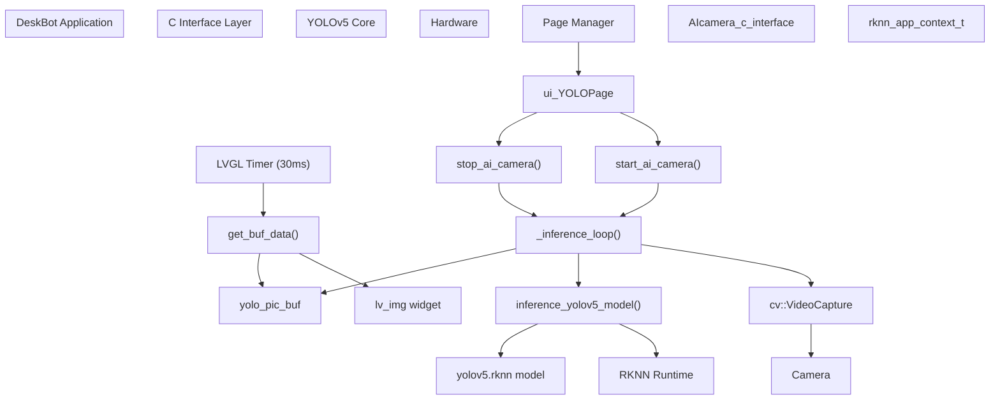
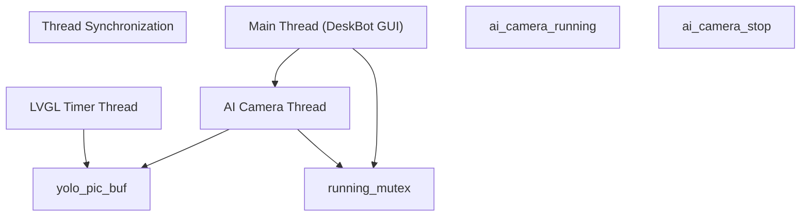
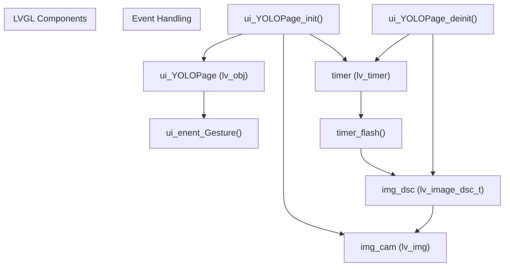
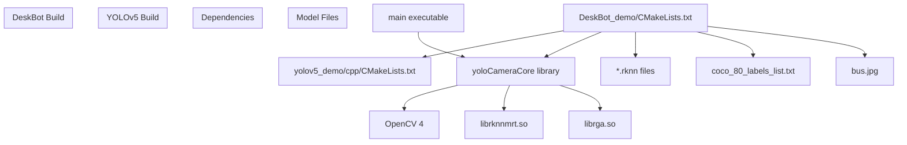

# Object Detection Integration

> **Relevant source files**
> * [DeskBot_demo/CMakeLists.txt](https://github.com/No-Chicken/Demo4Echo/blob/80ef46db/DeskBot_demo/CMakeLists.txt)
> * [DeskBot_demo/gui_app/pages/ui_YOLOPage/ui_YOLOPage.c](https://github.com/No-Chicken/Demo4Echo/blob/80ef46db/DeskBot_demo/gui_app/pages/ui_YOLOPage/ui_YOLOPage.c)
> * [yolov5_demo/cpp/AIcamera_c_interface.cc](https://github.com/No-Chicken/Demo4Echo/blob/80ef46db/yolov5_demo/cpp/AIcamera_c_interface.cc)
> * [yolov5_demo/cpp/AIcamera_c_interface.h](https://github.com/No-Chicken/Demo4Echo/blob/80ef46db/yolov5_demo/cpp/AIcamera_c_interface.h)
> * [yolov5_demo/cpp/CMakeLists.txt](https://github.com/No-Chicken/Demo4Echo/blob/80ef46db/yolov5_demo/cpp/CMakeLists.txt)
> * [yolov5_demo/cpp/main.cc](https://github.com/No-Chicken/Demo4Echo/blob/80ef46db/yolov5_demo/cpp/main.cc)
> * [yolov5_demo/cpp/main2.cc](https://github.com/No-Chicken/Demo4Echo/blob/80ef46db/yolov5_demo/cpp/main2.cc)
> * [yolov5_demo/cpp/rv1106_yolov5_demo/c_face_test](https://github.com/No-Chicken/Demo4Echo/blob/80ef46db/yolov5_demo/cpp/rv1106_yolov5_demo/c_face_test)
> * [yolov5_demo/cpp/rv1106_yolov5_demo/rknn_yolov5_demo](https://github.com/No-Chicken/Demo4Echo/blob/80ef46db/yolov5_demo/cpp/rv1106_yolov5_demo/rknn_yolov5_demo)
> * [yolov5_demo/cpp/toolchain.cmake](https://github.com/No-Chicken/Demo4Echo/blob/80ef46db/yolov5_demo/cpp/toolchain.cmake)

This document covers how YOLOv5 object detection is integrated into the DeskBot demo application. It explains the C interface layer that bridges the standalone YOLOv5 demo with the LVGL-based GUI system, enabling real-time object detection display within the DeskBot interface.

For information about the standalone YOLOv5 demo implementation, see [6](/No-Chicken/Demo4Echo/6-yolov5-demo-object-detection). For details about the DeskBot GUI system and page management, see [4.1](/No-Chicken/Demo4Echo/4.1-gui-system-and-page-management).

## Architecture Overview

The object detection integration uses a layered architecture that allows the standalone YOLOv5 demo to be embedded within the DeskBot GUI application through a C interface wrapper.



**Sources:** [DeskBot_demo/gui_app/pages/ui_YOLOPage/ui_YOLOPage.c L1-L114](https://github.com/No-Chicken/Demo4Echo/blob/80ef46db/DeskBot_demo/gui_app/pages/ui_YOLOPage/ui_YOLOPage.c#L1-L114)

 [yolov5_demo/cpp/AIcamera_c_interface.cc L1-L221](https://github.com/No-Chicken/Demo4Echo/blob/80ef46db/yolov5_demo/cpp/AIcamera_c_interface.cc#L1-L221)

 [yolov5_demo/cpp/AIcamera_c_interface.h L1-L17](https://github.com/No-Chicken/Demo4Echo/blob/80ef46db/yolov5_demo/cpp/AIcamera_c_interface.h#L1-L17)

## C Interface Layer

The C interface layer provides a clean abstraction that allows the C++ YOLOv5 implementation to be used from the C-based DeskBot application. This layer manages threading, memory allocation, and data transfer.

### Interface Functions

| Function | Purpose | Parameters |
| --- | --- | --- |
| `start_ai_camera()` | Initializes and starts object detection thread | `model_path`: Path to .rknn model file |
| `stop_ai_camera()` | Stops detection thread and cleans up resources | None |
| `get_buf_data()` | Copies processed frame data with detection overlays | `buffer`: Destination buffer for image data |

### Threading Architecture



**Sources:** [yolov5_demo/cpp/AIcamera_c_interface.cc L53-L57](https://github.com/No-Chicken/Demo4Echo/blob/80ef46db/yolov5_demo/cpp/AIcamera_c_interface.cc#L53-L57)

 [yolov5_demo/cpp/AIcamera_c_interface.cc L170-L210](https://github.com/No-Chicken/Demo4Echo/blob/80ef46db/yolov5_demo/cpp/AIcamera_c_interface.cc#L170-L210)

The interface uses pthread-based threading with mutex protection for thread-safe state management. The `_inference_loop()` function runs in a separate thread, continuously processing camera frames and updating the shared buffer `yolo_pic_buf`.

### Memory Management

The C interface manages a shared frame buffer that stores processed RGB565 image data:

* **Buffer Size**: 320×240×2 bytes (RGB565 format)
* **Allocation**: Dynamic allocation in `start_ai_camera()`
* **Access**: Thread-safe copying via `get_buf_data()`
* **Cleanup**: Automatic deallocation in `stop_ai_camera()`

**Sources:** [yolov5_demo/cpp/AIcamera_c_interface.cc L46-L51](https://github.com/No-Chicken/Demo4Echo/blob/80ef46db/yolov5_demo/cpp/AIcamera_c_interface.cc#L46-L51)

 [yolov5_demo/cpp/AIcamera_c_interface.cc L180-L181](https://github.com/No-Chicken/Demo4Echo/blob/80ef46db/yolov5_demo/cpp/AIcamera_c_interface.cc#L180-L181)

 [yolov5_demo/cpp/AIcamera_c_interface.cc

207](https://github.com/No-Chicken/Demo4Echo/blob/80ef46db/yolov5_demo/cpp/AIcamera_c_interface.cc#L207-L207)

## DeskBot Integration

The DeskBot integration implements a dedicated YOLO page that provides real-time object detection display within the LVGL GUI framework.

### UI Components



**Sources:** [DeskBot_demo/gui_app/pages/ui_YOLOPage/ui_YOLOPage.c L82-L101](https://github.com/No-Chicken/Demo4Echo/blob/80ef46db/DeskBot_demo/gui_app/pages/ui_YOLOPage/ui_YOLOPage.c#L82-L101)

 [DeskBot_demo/gui_app/pages/ui_YOLOPage/ui_YOLOPage.c L105-L114](https://github.com/No-Chicken/Demo4Echo/blob/80ef46db/DeskBot_demo/gui_app/pages/ui_YOLOPage/ui_YOLOPage.c#L105-L114)

### Real-time Display Loop

The YOLO page uses an LVGL timer to continuously update the display with processed frames:

1. **Timer Initialization**: 30ms interval timer created in `ui_YOLOPage_init()`
2. **First Frame Setup**: Memory allocation and AI camera startup on first timer callback
3. **Continuous Updates**: Timer callback reads buffer data and updates LVGL image widget
4. **Cleanup**: Timer deletion and memory cleanup in `ui_YOLOPage_deinit()`

**Sources:** [DeskBot_demo/gui_app/pages/ui_YOLOPage/ui_YOLOPage.c L53-L78](https://github.com/No-Chicken/Demo4Echo/blob/80ef46db/DeskBot_demo/gui_app/pages/ui_YOLOPage/ui_YOLOPage.c#L53-L78)

 [DeskBot_demo/gui_app/pages/ui_YOLOPage/ui_YOLOPage.c

93](https://github.com/No-Chicken/Demo4Echo/blob/80ef46db/DeskBot_demo/gui_app/pages/ui_YOLOPage/ui_YOLOPage.c#L93-L93)

### Image Format Configuration

The integration uses a specific image descriptor configuration optimized for the Echo development board display:

```
lv_image_dsc_t img_dsc = {    .header.w = 320,    .header.h = 240,     .data_size = 320 * 240 * 2,    .header.cf = LV_COLOR_FORMAT_RGB565,    .data = NULL,};
```

**Sources:** [DeskBot_demo/gui_app/pages/ui_YOLOPage/ui_YOLOPage.c L13-L19](https://github.com/No-Chicken/Demo4Echo/blob/80ef46db/DeskBot_demo/gui_app/pages/ui_YOLOPage/ui_YOLOPage.c#L13-L19)

## Build Integration

The build system integrates the YOLOv5 demo into DeskBot through CMake configuration that handles cross-compilation, library linking, and resource deployment.

### Library Integration



**Sources:** [DeskBot_demo/CMakeLists.txt L112-L140](https://github.com/No-Chicken/Demo4Echo/blob/80ef46db/DeskBot_demo/CMakeLists.txt#L112-L140)

 [yolov5_demo/cpp/CMakeLists.txt L40-L53](https://github.com/No-Chicken/Demo4Echo/blob/80ef46db/yolov5_demo/cpp/CMakeLists.txt#L40-L53)

### ARM Cross-Compilation

The YOLOv5 integration includes ARM-specific build configuration:

* **Conditional Compilation**: YOLO integration only enabled for ARM targets (`TARGET_ARM` flag)
* **Shared Libraries**: Runtime dependencies copied to output directory
* **RPATH Configuration**: Dynamic library loading paths set for embedded deployment

**Sources:** [DeskBot_demo/CMakeLists.txt

111](https://github.com/No-Chicken/Demo4Echo/blob/80ef46db/DeskBot_demo/CMakeLists.txt#L111-L111)

 [DeskBot_demo/CMakeLists.txt L142-L167](https://github.com/No-Chicken/Demo4Echo/blob/80ef46db/DeskBot_demo/CMakeLists.txt#L142-L167)

### Resource Deployment

The build system automatically deploys required model files and dependencies:

| Resource Type | Source Location | Deployment Target |
| --- | --- | --- |
| RKNN Models | `yolov5_demo/model/*.rknn` | `bin/model/` |
| Class Labels | `yolov5_demo/model/coco_80_labels_list.txt` | `bin/model/` |
| Shared Libraries | `yolov5_demo/cpp/3rdparty/` | `bin/lib/` |
| Test Images | `yolov5_demo/model/bus.jpg` | `bin/model/` |

**Sources:** [DeskBot_demo/CMakeLists.txt L117-L139](https://github.com/No-Chicken/Demo4Echo/blob/80ef46db/DeskBot_demo/CMakeLists.txt#L117-L139)

 [DeskBot_demo/CMakeLists.txt L142-L164](https://github.com/No-Chicken/Demo4Echo/blob/80ef46db/DeskBot_demo/CMakeLists.txt#L142-L164)

## Data Flow Architecture

The object detection integration implements a multi-threaded data flow that processes camera frames through the YOLO model and displays results in real-time.

```

```

**Sources:** [yolov5_demo/cpp/AIcamera_c_interface.cc L70-L167](https://github.com/No-Chicken/Demo4Echo/blob/80ef46db/yolov5_demo/cpp/AIcamera_c_interface.cc#L70-L167)

 [DeskBot_demo/gui_app/pages/ui_YOLOPage/ui_YOLOPage.c L53-L78](https://github.com/No-Chicken/Demo4Echo/blob/80ef46db/DeskBot_demo/gui_app/pages/ui_YOLOPage/ui_YOLOPage.c#L53-L78)

### Frame Processing Pipeline

The core processing pipeline transforms raw camera frames into annotated detection results:

1. **Capture**: OpenCV captures 640×480 frames from `/dev/video0`
2. **Resize**: Frames resized to 640×640 for YOLO model input
3. **Inference**: RKNN runtime processes frames through YOLOv5 model
4. **Post-processing**: Detection results filtered and coordinate-mapped
5. **Annotation**: Bounding boxes and labels drawn on original frame
6. **Format Conversion**: BGR to RGB565 conversion for display
7. **Buffer Update**: Processed frame copied to shared buffer

**Sources:** [yolov5_demo/cpp/AIcamera_c_interface.cc L113-L157](https://github.com/No-Chicken/Demo4Echo/blob/80ef46db/yolov5_demo/cpp/AIcamera_c_interface.cc#L113-L157)

## Key Components

### Thread Management

The C interface implements robust thread management with proper synchronization:

* **Mutex Protection**: `pthread_mutex_t running_mutex` protects state variables
* **Thread Lifecycle**: Clean startup/shutdown with `pthread_create()`/`pthread_join()`
* **State Flags**: `ai_camera_running` and `ai_camera_stop` control execution flow

**Sources:** [yolov5_demo/cpp/AIcamera_c_interface.cc L53-L56](https://github.com/No-Chicken/Demo4Echo/blob/80ef46db/yolov5_demo/cpp/AIcamera_c_interface.cc#L53-L56)

 [yolov5_demo/cpp/AIcamera_c_interface.cc L171-L178](https://github.com/No-Chicken/Demo4Echo/blob/80ef46db/yolov5_demo/cpp/AIcamera_c_interface.cc#L171-L178)

 [yolov5_demo/cpp/AIcamera_c_interface.cc L193-L205](https://github.com/No-Chicken/Demo4Echo/blob/80ef46db/yolov5_demo/cpp/AIcamera_c_interface.cc#L193-L205)

### LVGL Integration

The YOLO page integrates seamlessly with the LVGL GUI system:

* **Page Lifecycle**: Standard init/deinit pattern matching other DeskBot pages
* **Event Handling**: Gesture events for navigation (left/right swipe to return)
* **Timer-based Updates**: Non-blocking display updates using LVGL timer system
* **Memory Management**: Proper allocation/deallocation of image descriptor data

**Sources:** [DeskBot_demo/gui_app/pages/ui_YOLOPage/ui_YOLOPage.c L29-L39](https://github.com/No-Chicken/Demo4Echo/blob/80ef46db/DeskBot_demo/gui_app/pages/ui_YOLOPage/ui_YOLOPage.c#L29-L39)

 [DeskBot_demo/gui_app/pages/ui_YOLOPage/ui_YOLOPage.c L56-L70](https://github.com/No-Chicken/Demo4Echo/blob/80ef46db/DeskBot_demo/gui_app/pages/ui_YOLOPage/ui_YOLOPage.c#L56-L70)

### Error Handling

The integration includes comprehensive error handling:

* **Camera Initialization**: Model loading and context setup validation
* **Memory Allocation**: Buffer allocation failure detection with user feedback
* **Thread Safety**: Mutex-protected state access prevents race conditions
* **Resource Cleanup**: Automatic cleanup on failure paths

**Sources:** [yolov5_demo/cpp/AIcamera_c_interface.cc L183-L190](https://github.com/No-Chicken/Demo4Echo/blob/80ef46db/yolov5_demo/cpp/AIcamera_c_interface.cc#L183-L190)

 [DeskBot_demo/gui_app/pages/ui_YOLOPage/ui_YOLOPage.c L61-L69](https://github.com/No-Chicken/Demo4Echo/blob/80ef46db/DeskBot_demo/gui_app/pages/ui_YOLOPage/ui_YOLOPage.c#L61-L69)