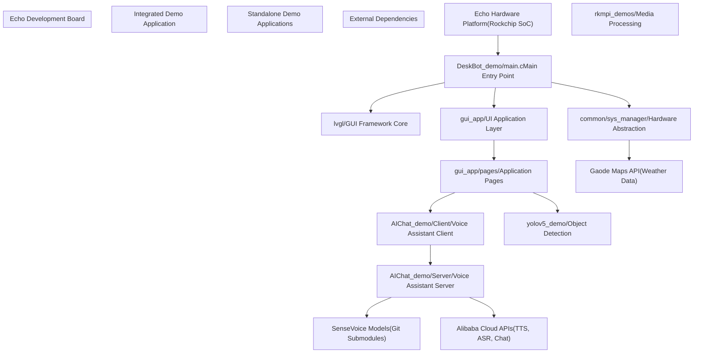
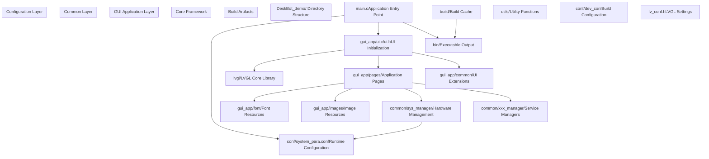

# Overview

> **Relevant source files**
> * [AIChat_demo/README.md](https://github.com/No-Chicken/Demo4Echo/blob/80ef46db/AIChat_demo/README.md?plain=1)
> * [DeskBot_demo/README.md](https://github.com/No-Chicken/Demo4Echo/blob/80ef46db/DeskBot_demo/README.md?plain=1)
> * [README.md](https://github.com/No-Chicken/Demo4Echo/blob/80ef46db/README.md?plain=1)

This document provides a comprehensive overview of the Demo4Echo repository, which contains demonstration applications for the Echo development board platform. The Echo board is based on a Rockchip SoC and serves as a hardware platform for running various AI-powered applications including voice assistants, object detection, and interactive GUI applications.

This overview covers the repository structure, main demo applications, system architecture, and key technologies. For detailed implementation information about specific demos, see [DeskBot Demo - AI Desktop Assistant](/No-Chicken/Demo4Echo/4-deskbot-demo-ai-desktop-assistant), [AIChat Demo - Voice Assistant](/No-Chicken/Demo4Echo/5-aichat-demo-voice-assistant), and [YOLOv5 Demo - Object Detection](/No-Chicken/Demo4Echo/6-yolov5-demo-object-detection). For setup and configuration details, see [Getting Started](/No-Chicken/Demo4Echo/2-getting-started) and [Configuration Reference](/No-Chicken/Demo4Echo/7-configuration-reference).

## Hardware Platform

The Echo development board serves as the foundation hardware platform for all demos in this repository. Built around a Rockchip SoC, the board provides:

* ARM-based processing capabilities suitable for embedded AI applications
* LCD display interface for GUI applications
* Audio input/output capabilities for voice processing
* GPIO pins for motor control and sensor interfacing
* WiFi connectivity for cloud service integration
* Camera interface for computer vision applications

The board supports cross-compilation from x86 development machines and can run applications with SDL simulation for development and testing.

## Demo Applications Architecture

The repository contains both standalone demo applications and an integrated desktop assistant that combines multiple functionalities. The following diagram shows the overall application architecture and how components relate to each other:

**Repository Application Structure**

Sources: [README.md L1-L112](https://github.com/No-Chicken/Demo4Echo/blob/80ef46db/README.md?plain=1#L1-L112)

 [DeskBot_demo/README.md L1-L58](https://github.com/No-Chicken/Demo4Echo/blob/80ef46db/DeskBot_demo/README.md?plain=1#L1-L58)

## DeskBot Demo - Main Integrated Application

The primary application is the DeskBot demo, located in `DeskBot_demo/`, which provides an integrated AI desktop assistant with a robot interface. This application uses LVGL as its GUI framework and incorporates functionality from the standalone demos.

**DeskBot Internal Architecture**

Sources: [README.md L27-L47](https://github.com/No-Chicken/Demo4Echo/blob/80ef46db/README.md?plain=1#L27-L47)

 [DeskBot_demo/README.md L1-L58](https://github.com/No-Chicken/Demo4Echo/blob/80ef46db/DeskBot_demo/README.md?plain=1#L1-L58)

## Standalone Demo Applications

### AIChat Demo - Voice Assistant

The AIChat demo implements a sophisticated voice assistant using a client-server architecture. The client runs on the Echo board while the server can run on a separate machine with more computational resources.

**Key Components:**

* **Client**: C++ application with C interface layer for LVGL integration
* **Server**: Python application managing AI model pipeline
* **Communication**: WebSocket protocol with JSON messages and Opus audio format
* **AI Models**: FSMN-VAD for voice activity detection, SenseVoice for speech recognition, CosyVoice for text-to-speech

### YOLOv5 Demo - Object Detection

Standalone computer vision demo using YOLOv5s pre-trained models for real-time object detection through the camera interface.

### RKMPI Demos - Media Processing

Hardware-specific demos for Rockchip Media Process Interface (RKMPI), including video input (VI) and RTSP streaming capabilities.

## Technology Stack

| Component | Technology | Purpose |
| --- | --- | --- |
| GUI Framework | LVGL v9.2 | Cross-platform GUI library for embedded systems |
| Build System | CMake | Cross-compilation and dependency management |
| Audio Processing | PortAudio, ALSA | Audio capture and playback |
| Communication | WebSocket, JSON | Client-server messaging protocol |
| AI Models | SenseVoice, FSMN-VAD, CosyVoice | Speech processing and generation |
| Computer Vision | YOLOv5 | Object detection and recognition |
| Cloud Services | Alibaba Cloud APIs | TTS, ASR, and conversational AI |
| Development | SDL | GUI simulation for development |

## External Service Integration

The demos integrate with several external services and APIs:

* **Alibaba Cloud Services**: Tongyi Qianwen for conversational AI, CosyVoice for text-to-speech
* **Gaode Maps API**: Weather data and location services for the weather application page
* **NTP Services**: Network time synchronization for system clock management
* **ModelScope**: Chinese AI model repository for downloading pre-trained models

## Build and Deployment Options

The repository supports multiple build configurations:

1. **SDL Simulation**: Development mode running on Ubuntu/Linux desktop with GUI simulation
2. **ARM Cross-Compilation**: Production mode for deployment to Echo development board
3. **Hybrid Deployment**: Client on Echo board communicating with server on development machine

Build configuration is controlled through `conf/dev_conf` with the `LV_USE_SIMULATOR` flag determining the target platform.

Sources: [README.md L1-L112](https://github.com/No-Chicken/Demo4Echo/blob/80ef46db/README.md?plain=1#L1-L112)

 [DeskBot_demo/README.md L1-L58](https://github.com/No-Chicken/Demo4Echo/blob/80ef46db/DeskBot_demo/README.md?plain=1#L1-L58)

 [AIChat_demo/README.md L1-L3](https://github.com/No-Chicken/Demo4Echo/blob/80ef46db/AIChat_demo/README.md?plain=1#L1-L3)