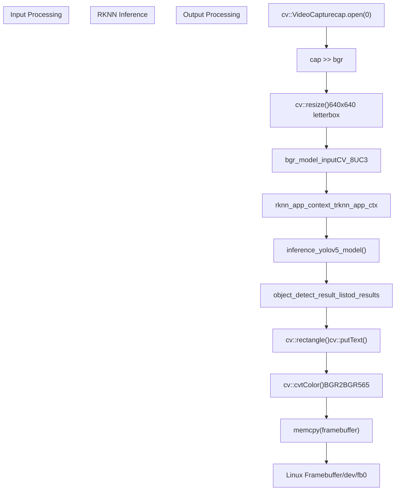
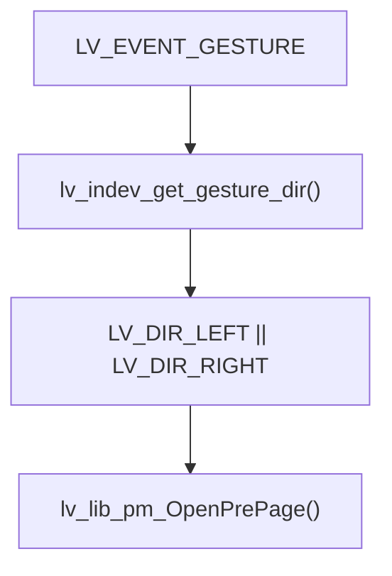
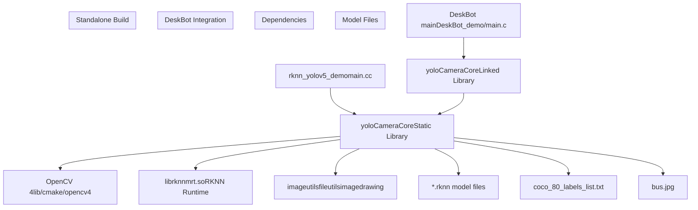

# YOLOv5 Demo - Object Detection

> **Relevant source files**
> * [DeskBot_demo/CMakeLists.txt](https://github.com/No-Chicken/Demo4Echo/blob/80ef46db/DeskBot_demo/CMakeLists.txt)
> * [DeskBot_demo/gui_app/pages/ui_YOLOPage/ui_YOLOPage.c](https://github.com/No-Chicken/Demo4Echo/blob/80ef46db/DeskBot_demo/gui_app/pages/ui_YOLOPage/ui_YOLOPage.c)
> * [yolov5_demo/cpp/AIcamera_c_interface.cc](https://github.com/No-Chicken/Demo4Echo/blob/80ef46db/yolov5_demo/cpp/AIcamera_c_interface.cc)
> * [yolov5_demo/cpp/AIcamera_c_interface.h](https://github.com/No-Chicken/Demo4Echo/blob/80ef46db/yolov5_demo/cpp/AIcamera_c_interface.h)
> * [yolov5_demo/cpp/CMakeLists.txt](https://github.com/No-Chicken/Demo4Echo/blob/80ef46db/yolov5_demo/cpp/CMakeLists.txt)
> * [yolov5_demo/cpp/main.cc](https://github.com/No-Chicken/Demo4Echo/blob/80ef46db/yolov5_demo/cpp/main.cc)
> * [yolov5_demo/cpp/main2.cc](https://github.com/No-Chicken/Demo4Echo/blob/80ef46db/yolov5_demo/cpp/main2.cc)
> * [yolov5_demo/cpp/rv1106_yolov5_demo/c_face_test](https://github.com/No-Chicken/Demo4Echo/blob/80ef46db/yolov5_demo/cpp/rv1106_yolov5_demo/c_face_test)
> * [yolov5_demo/cpp/rv1106_yolov5_demo/rknn_yolov5_demo](https://github.com/No-Chicken/Demo4Echo/blob/80ef46db/yolov5_demo/cpp/rv1106_yolov5_demo/rknn_yolov5_demo)
> * [yolov5_demo/cpp/toolchain.cmake](https://github.com/No-Chicken/Demo4Echo/blob/80ef46db/yolov5_demo/cpp/toolchain.cmake)

This document covers the standalone YOLOv5 object detection demo and its integration capabilities within the Echo development board ecosystem. The system provides real-time object detection using the Rockchip RKNN inference engine with camera input and display output capabilities.

For information about the DeskBot GUI integration, see [DeskBot Demo - AI Desktop Assistant](/No-Chicken/Demo4Echo/4-deskbot-demo-ai-desktop-assistant). For the broader Echo development board platform overview, see [Overview](/No-Chicken/Demo4Echo/1-overview).

## Architecture Overview

The YOLOv5 demo consists of a standalone application with an optional C interface layer that enables integration into larger applications like DeskBot.

```

```

**Sources:** [yolov5_demo/cpp/main.cc L58-L216](https://github.com/No-Chicken/Demo4Echo/blob/80ef46db/yolov5_demo/cpp/main.cc#L58-L216)

 [yolov5_demo/cpp/AIcamera_c_interface.cc L1-L221](https://github.com/No-Chicken/Demo4Echo/blob/80ef46db/yolov5_demo/cpp/AIcamera_c_interface.cc#L1-L221)

 [yolov5_demo/cpp/AIcamera_c_interface.h L1-L17](https://github.com/No-Chicken/Demo4Echo/blob/80ef46db/yolov5_demo/cpp/AIcamera_c_interface.h#L1-L17)

 [DeskBot_demo/gui_app/pages/ui_YOLOPage/ui_YOLOPage.c L1-L114](https://github.com/No-Chicken/Demo4Echo/blob/80ef46db/DeskBot_demo/gui_app/pages/ui_YOLOPage/ui_YOLOPage.c#L1-L114)

## Standalone Demo Implementation

The standalone demo in `main.cc` provides a complete object detection application that captures camera input, runs YOLOv5 inference, and displays results on the framebuffer.

### Core Data Flow



**Sources:** [yolov5_demo/cpp/main.cc L135-L196](https://github.com/No-Chicken/Demo4Echo/blob/80ef46db/yolov5_demo/cpp/main.cc#L135-L196)

### Key Components

| Component | Purpose | Key Functions |
| --- | --- | --- |
| **Model Initialization** | Load RKNN model and setup inference context | `init_yolov5_model()`, `init_post_process()` |
| **Camera Capture** | OpenCV-based camera input with resolution settings | `cv::VideoCapture::open()`, `cv::VideoCapture::set()` |
| **Framebuffer Management** | Linux framebuffer access for display output | `open("/dev/fb0")`, `mmap()`, `ioctl()` |
| **Coordinate Mapping** | Map detection coordinates between model and display | `mapCoordinates()` |
| **FPS Calculation** | Performance monitoring using clock timing | `clock()`, fps calculation |

**Sources:** [yolov5_demo/cpp/main.cc L58-L216](https://github.com/No-Chicken/Demo4Echo/blob/80ef46db/yolov5_demo/cpp/main.cc#L58-L216)

## C Interface for Integration

The C interface layer enables the YOLOv5 detection pipeline to be embedded in other applications through a clean API and separate thread execution.

### Threading Architecture

```

```

**Sources:** [yolov5_demo/cpp/AIcamera_c_interface.cc L170-L220](https://github.com/No-Chicken/Demo4Echo/blob/80ef46db/yolov5_demo/cpp/AIcamera_c_interface.cc#L170-L220)

### API Functions

The C interface provides three primary functions for external integration:

| Function | Purpose | Parameters | Return Value |
| --- | --- | --- | --- |
| `start_ai_camera()` | Initialize and start detection thread | `const char* model_path` | `int` (0 success, -1 failure) |
| `stop_ai_camera()` | Stop detection thread and cleanup | None | `int` (0 success, -1 failure) |
| `get_buf_data()` | Copy current frame buffer | `uint8_t* buffer` | `void` |

**Sources:** [yolov5_demo/cpp/AIcamera_c_interface.h L8-L11](https://github.com/No-Chicken/Demo4Echo/blob/80ef46db/yolov5_demo/cpp/AIcamera_c_interface.h#L8-L11)

 [yolov5_demo/cpp/AIcamera_c_interface.cc L170-L220](https://github.com/No-Chicken/Demo4Echo/blob/80ef46db/yolov5_demo/cpp/AIcamera_c_interface.cc#L170-L220)

### Thread Safety Implementation

The interface uses pthread synchronization primitives to ensure thread-safe operation:

* **Mutex Protection**: `pthread_mutex_t running_mutex` protects state access
* **Stop Signaling**: `ai_camera_stop` flag for graceful thread termination
* **Buffer Management**: Separate buffer allocation for thread-safe data access
* **Error Handling**: Proper cleanup on initialization failures

**Sources:** [yolov5_demo/cpp/AIcamera_c_interface.cc L53-L57](https://github.com/No-Chicken/Demo4Echo/blob/80ef46db/yolov5_demo/cpp/AIcamera_c_interface.cc#L53-L57)

 [yolov5_demo/cpp/AIcamera_c_interface.cc L170-L220](https://github.com/No-Chicken/Demo4Echo/blob/80ef46db/yolov5_demo/cpp/AIcamera_c_interface.cc#L170-L220)

## DeskBot Integration

The YOLOv5 demo integrates into the DeskBot application through an LVGL-based page that displays the camera feed with detection overlays.

### LVGL Page Implementation

```

```

**Sources:** [DeskBot_demo/gui_app/pages/ui_YOLOPage/ui_YOLOPage.c L82-L114](https://github.com/No-Chicken/Demo4Echo/blob/80ef46db/DeskBot_demo/gui_app/pages/ui_YOLOPage/ui_YOLOPage.c#L82-L114)

### Image Display Configuration

The LVGL integration uses specific image format settings optimized for the Echo board's display capabilities:

| Parameter | Value | Purpose |
| --- | --- | --- |
| **Width** | 320 pixels | Match display resolution |
| **Height** | 240 pixels | Match display resolution |
| **Format** | `LV_COLOR_FORMAT_RGB565` | 16-bit color format |
| **Buffer Size** | 320 × 240 × 2 bytes | Total memory requirement |
| **Update Rate** | 30ms timer | ~33 FPS refresh rate |

**Sources:** [DeskBot_demo/gui_app/pages/ui_YOLOPage/ui_YOLOPage.c L8-L19](https://github.com/No-Chicken/Demo4Echo/blob/80ef46db/DeskBot_demo/gui_app/pages/ui_YOLOPage/ui_YOLOPage.c#L8-L19)

### Gesture Navigation

The YOLO page supports gesture-based navigation for returning to the previous page:



**Sources:** [DeskBot_demo/gui_app/pages/ui_YOLOPage/ui_YOLOPage.c L29-L39](https://github.com/No-Chicken/Demo4Echo/blob/80ef46db/DeskBot_demo/gui_app/pages/ui_YOLOPage/ui_YOLOPage.c#L29-L39)

## Build System and Dependencies

The build system supports both standalone compilation and integration into the DeskBot demo through CMake configuration.

### Compilation Targets



**Sources:** [yolov5_demo/cpp/CMakeLists.txt L40-L77](https://github.com/No-Chicken/Demo4Echo/blob/80ef46db/yolov5_demo/cpp/CMakeLists.txt#L40-L77)

 [DeskBot_demo/CMakeLists.txt L112-L140](https://github.com/No-Chicken/Demo4Echo/blob/80ef46db/DeskBot_demo/CMakeLists.txt#L112-L140)

### Cross-Compilation Configuration

The build system uses ARM cross-compilation for the Echo board's Rockchip RV1106 processor:

| Component | Configuration | Path |
| --- | --- | --- |
| **Toolchain** | arm-rockchip830-linux-uclibcgnueabihf | `/tools/linux/toolchain/` |
| **Sysroot** | Buildroot 2023.02.6 | `/sysdrv/source/buildroot/` |
| **RKNN Library** | armhf-uclibc | `3rdparty/rknpu2/Linux/armhf-uclibc/` |
| **RGA Library** | armhf_uclibc | `3rdparty/librga/Linux/armhf_uclibc/` |

**Sources:** [yolov5_demo/cpp/toolchain.cmake L1-L19](https://github.com/No-Chicken/Demo4Echo/blob/80ef46db/yolov5_demo/cpp/toolchain.cmake#L1-L19)

 [yolov5_demo/cpp/CMakeLists.txt L20-L24](https://github.com/No-Chicken/Demo4Echo/blob/80ef46db/yolov5_demo/cpp/CMakeLists.txt#L20-L24)

### Runtime Dependencies

The application requires several shared libraries and model files to be deployed alongside the executable:

* **RKNN Runtime**: `librknnmrt.so` for neural network inference
* **RGA Library**: `librga.so` for hardware-accelerated image processing
* **Model Files**: YOLOv5 model converted to RKNN format (`.rknn`)
* **Label Files**: COCO class names for object classification
* **RPATH Configuration**: `$ORIGIN/lib` for relative library loading

**Sources:** [yolov5_demo/cpp/CMakeLists.txt L92-L100](https://github.com/No-Chicken/Demo4Echo/blob/80ef46db/yolov5_demo/cpp/CMakeLists.txt#L92-L100)

 [DeskBot_demo/CMakeLists.txt L116-L167](https://github.com/No-Chicken/Demo4Echo/blob/80ef46db/DeskBot_demo/CMakeLists.txt#L116-L167)